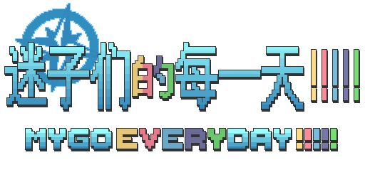

## 本项目正在积极开发中，敬请期待
### 你可以通过[部署的pages](https://ryarasuki.github.io/MyGoEveryday/)进行最新进度预览

 

  

  <h2 align="center">迷子们的每一天 !!!!!</h2>
  <h3 align="center">MyGo Everyday !!!!!</h3>
  
  
一个基于BanGDream！世界观的二次创作文字互动网页，主体部分使用Sugarcube2完成，原创代码部分遵从 [MIT LICENSE] 开源许可，原创文字、图像等遵从 [CC BY-NC-SA 4.0] 协议
     
     
    <a href="https://ryarasuki.github.io/MyGoEveryday/"><strong>游玩网页版 »</strong></a>
     
     
    <a href="https://github.com/RyaraSUKI/MyGoEveryday/releases/latest">最新发布版</a>
    ·
    <a href="https://github.com/RyaraSUKI/MyGoEveryday/blob/master/docs/COWORK.md">[参与创作！]</a>
    ·
    <a href="https://github.com/RyaraSUKI/MyGoEveryday/issues">反馈与建议</a>
  

### 请确保使用现代浏览器！请禁用浏览器的自动翻译插件！

## 目录

- [简介](#简介)
- [参与创作](#参与创作)
- [使用说明](#使用说明)
- [待办项目](#待办项目)
- [创作者](#创作者)
- [版权声明](#版权声明)
- [更新日志](#更新日志)
- [引用与鸣谢](#引用与鸣谢)

## 简介

> 『不畏迷茫，迷茫着也要砥砺前行——』

通过五个不同的视角，去看迷路的每一天， 
在迷子们和朋友们的互动中， 
逐渐展现属于MyGO!!!!!&Ave Mujica官方剧情中十一个主要角色的羁绊。
  
**迷子们的平淡日常，一日一月，一点一滴，汇聚成了她们的故事，
一辈子的誓言，映射在每一天。**
  
本互动网页小说提供了三种不同的模式，分为**主线故事『OurStory』**、**迷子日常『DailyStory』**和**附加故事『AnotherStory』**，在游玩中，感受不同选项带来的独特体验。
  
同时，本项目意在建设一个开放包容的二创社区，欢迎各位热爱MyGO!!!!!&Ave Mujica以及BanGDream!的邦邦人参与到创作中，让我们写出自己认可的故事，感受这个企划真正的美好，体会来自初心的快乐！

## 参与创作

『迷子们的每一天 !!!!!』欢迎所有热爱者的共同创作，请在[此处](https://github.com/RyaraSUKI/MyGoEveryday/blob/master/docs/COWORK.md)查看指引！
另外，欢迎加入[讨论群]():

## 使用说明

- 你可以直接前往[GitHub Pages](https://ryarasuki.github.io/MyGoEveryday/)游玩已部署的最新版，如果你要下载本地版或历史版本，请前往[Releases](https://github.com/RyaraSUKI/MyGoEveryday/releases)

**格式说明：**
- apk：安卓软件安装包，可自行安装，本项目完全安全无风险
- exe：Windows可执行文件，可自行双击运行
- zip：包含html和资源文件夹，下载后请解压，确保html文件和资源文件夹在同一文件夹内，请使用任意**现代浏览器**打开html

## 待办项目
~~画饼清单~~
- [X] 最初的起点
- [ ] UI样式性能优化
- [ ] 加入换装系统
- [ ] 加入互动游戏
- [ ] 加入商店系统
- [ ] 丰富网页内容
- [ ] 存档系统更新
- [ ] 附加故事实现

## 创作者

- [点击查看](https://github.com/RyaraSUKI/MyGoEveryday/blob/master/CREDITS.md)

## 版权声明

- [点击查看](https://github.com/RyaraSUKI/MyGoEveryday/blob/master/LICENSE.md)

## 更新记录

- [点击查看](https://github.com/RyaraSUKI/MyGoEveryday/blob/master/docs/UPDATE.md)

## 引用与鸣谢

> 以下是『迷子们的每一天 !!!!!』完整的引用列表，感谢所有提供支持的开源项目贡献者的无私奉献！

- [点击查看](https://github.com/RyaraSUKI/MyGoEveryday/blob/master/CREDITS.md)

**特别鸣谢**

- 感谢[Sguarcube2群代码整合](https://www.yuque.com/u45355763/twine)所有热心群友们的帮助！
- 感谢[GitHub Pages](https://pages.github.com)提供网页托管！

 

[<a href="#top">返回顶部</a>]
