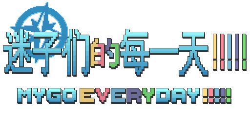

<div id="top"></div>

<br />
<div align="center">
  <a href="https://github.com/RyaraSUKI/MyGoEveryday">
    
  </a>

  <h2 align="center">迷子们的每一天 !!!!!</h2>
  <h3 align="center">MyGo Everyday !!!!!</h3>
  <p align="center">  
一个基于BanGDream！世界观的二次创作文字互动网页，主体部分使用Sugarcube2完成，原创代码部分遵从 [MIT LICENSE] 开源许可，原创文字、图像等遵从 [CC BY-NC-SA 4.0] 协议    
    <br />
    <br />
    <a href="https://github.com/RyaraSUKI/MyGoEveryday"><strong>游玩网页版 »</strong></a>
    <br />
    <br />
    <a href="https://github.com/RyaraSUKI/MyGoEveryday/releases/latest">最新发布版</a>
    ·
    <a href="https://github.com/RyaraSUKI/MyGoEveryday/issues">反馈Bug</a>
    ·
    <a href="https://github.com/RyaraSUKI/MyGoEveryday/issues">提议新功能</a>
  </p>
</div>
 
## 目录

- [简介](#简介)
- [贡献者](#贡献者)
- [版权声明](#版权声明)
- [更新日志](#更新日志)
- [使用说明](#使用说明)
- [编译说明](#编译说明)
- [待办项目](#待办项目)
- [引用与鸣谢](#引用与鸣谢)

### 简介


### 贡献者

初创：RyaraSUKI

### 版权声明

- [点击查看](https://github.com/RyaraSUKI/MyGoEveryday/blob/master/LICENSE.md)

### 更新记录

- [点击查看](https://github.com/RyaraSUKI/MyGoEveryday/blob/master/UPDATE.md)

### 使用说明

- 你可以直接前往[github-pages]游玩已部署的最新版，如果你要下载本地版或历史版本，请前往[Releases](https://github.com/RyaraSUKI/MyGoEveryday/releases)

---
格式说明：
- apk：安卓软件安装包，可自行安装，本项目完全安全无风险
- exe：Windows可执行文件，可自行双击运行
- zip：包含html和资源文件夹，下载后请解压，确保html文件和资源文件夹在同一文件夹内，请使用任意**现代浏览器**打开html

### 编译说明
欢迎各位大佬参与本项目贡献！
- 如果你熟悉Twine的操作方式，要修改本项目，你可以直接将最新版的_index-orig.html_导入Twine软件中
- 请不要直接导入发布版带有Modloader的html，Twine2软件将会报错，请直接前往[仓库master分支]或[Release]下载[原版html]

#### tweego编译原版html

> tweego是Twine引擎网页游戏的命令行编译工具，可以将分散的文件编译成html，有基础的话强烈推荐使用这个工具进行开发

以下提供使用tweego的编译说明：
1. 前往[tweego官方网站](https://www.motoslave.net/tweego/)或[tweego的仓库](https://github.com/tmedwards/tweego)下载最新版 tweego，注意选择自己系统的版本
2. 前往[本仓库开发工具中](https://github.com/RyaraSUKI/MyGoEveryday/blob/master/devtools/storyformats)下载MyGo Everyday !!!!! 专用修改版Sugarcube2故事格式，然后将全部文件放置/替换在
```
/你的项目/tweego文件夹/storyformats/sugarcube-2/
```
3. 编译命令，-o 为发布编译，-t 为调试模式编译，具体参数参见[tweego文档](https://www.motoslave.net/tweego/docs/)
- 注意，只需编译game/即可，否则将连同图片字体等资源文件一起编译导致html容量剧增！
```
tweego -o /你的项目/mygoeveryday根文件夹/game/
```
#### 注入Modloader

#### 打包

#### 其余建议
- 推荐使用VSC进行编辑，有一个[适配twee文件的插件](https://marketplace.visualstudio.com/items?itemName=cyrusfirheir.twee3-language-tools)推荐下载

### 待办项目
- [X] 最初的起点
- [ ] 继续优化ui装修
- [ ] 加入换装系统
- [ ] 加入互动游戏
- [ ] 加入商店系统
- [ ] 丰富网页内容
- [ ] 存档系统更新

### 引用与鸣谢

> 『迷子们的每一天 !!!!!』的主体引擎和模组加载器使用了以下项目，在此表示感谢！

- [Twine](https://twinery.org/)
- [Sugarcube2](https://github.com/tmedwards/sugarcube-2)
- [Modloader](https://github.com/Lyoko-Jeremie/sugarcube-2-ModLoader)

> 像素字体使用了unifont点阵字体，遵守GNU General Public协议
- [Unifont](https://unifoundry.com/unifont/index.html)

> 以下是本项目完整的引用列表，感谢所有提供支持的开源项目！

- [点击查看](https://github.com/RyaraSUKI/MyGoEveryday/blob/master/USEDLIBS.md))

> 特别鸣谢

- 感谢[Sguarcube2群代码整合](https://www.yuque.com/u45355763/twine)热心群友们的帮助！
- 感谢[GitHub Pages](https://pages.github.com)提供网页托管！

<br>
<p align="center">[<a href="#top">返回顶部</a>]</p>